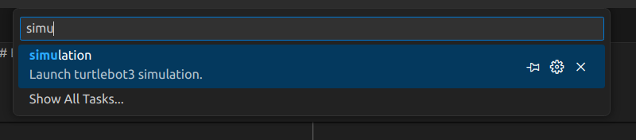

# module 1

## Theory

- ROS 2 architecture
- ROS 2 nodes
- ROS 2 topics
- ROS 2 messages
- CLI commands

## Exercise

Goal of this exercise is to familiarize with ROS 2 system by investigating Turtlebot3 Gazebo-based simulation.

1. Start simulation
  
    The simulation is already integrated with working environment.

    All you need to do is to launch it via predefined vscode task:
  
   1. Invoke tasks list

        ```bash
        ctrl + shift + t
        ```

   2. Select `simulation` task

        

2. Inspect the created nodes and their topics

    _Lecture slides (pages xx-xx)_

   1. List active nodes
   2. Check details of the `/turtlebot3_laserscan` node
   3. List available topics
   4. Check type of LIDAR's topic (`/scan`)
   5. Listen to topic (`/scan`)
   6. Check the message definition `/scan` topic type  
   7. Check what is the LIDAR topic (`/scan`) frequency

3. Command a desired velocity to the turtlebot using terminal

    _Lecture slides (pages xx-xx)_

4. Use the `​teleop_twist_keyboard` ​to control your robot using the keyboard. Find it online and compile it from source! Use `​git clone​` to clone the repository to the `src`.

    _Lecture slides (pages xx-xx)_

    For a short git overview refer to [git cheat sheet](http://rogerdudler.github.io/git-guide/files/git_cheat_sheet.pdf)
