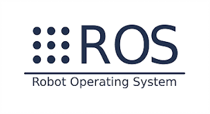
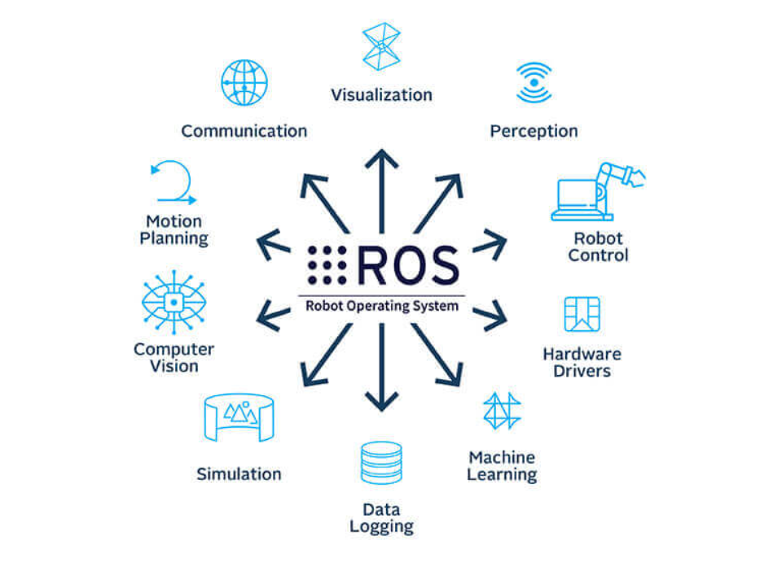
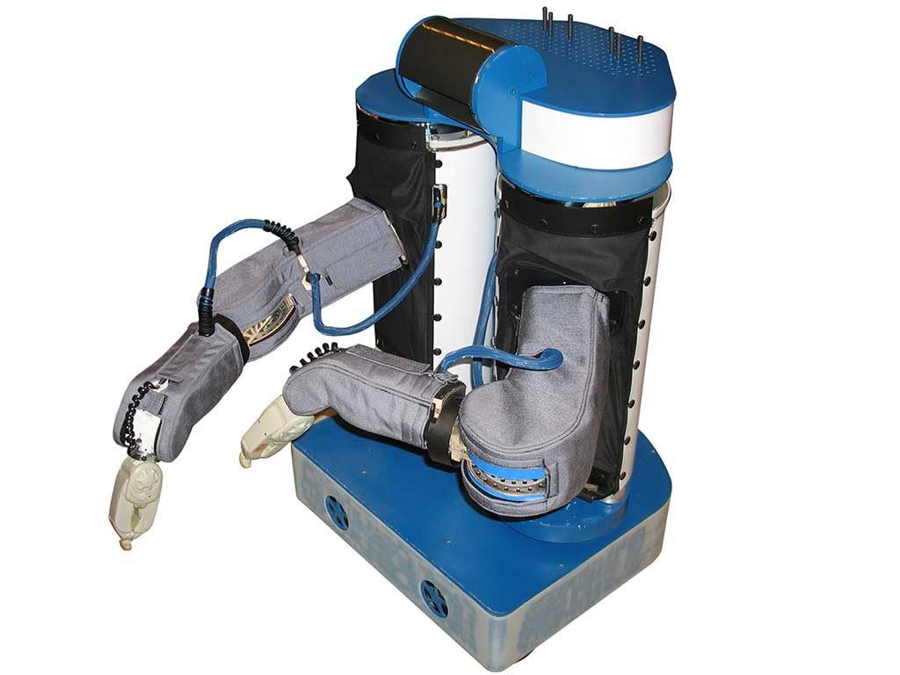
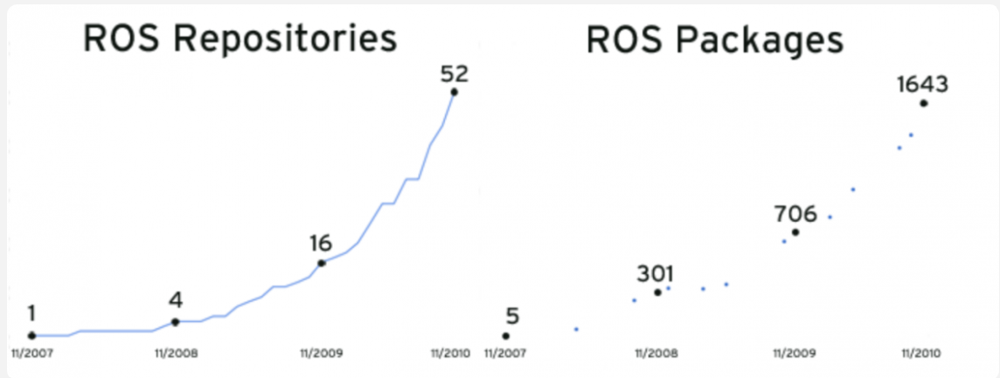
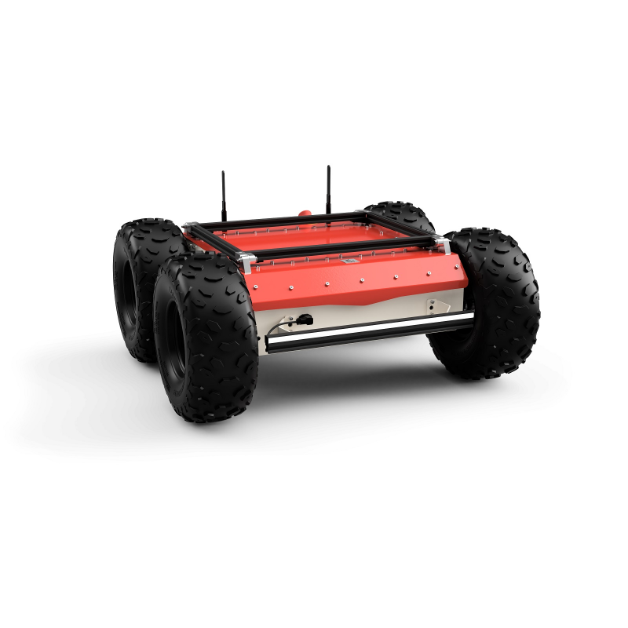
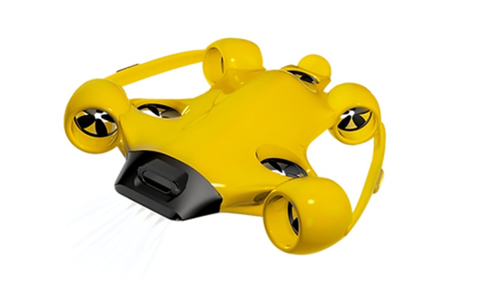
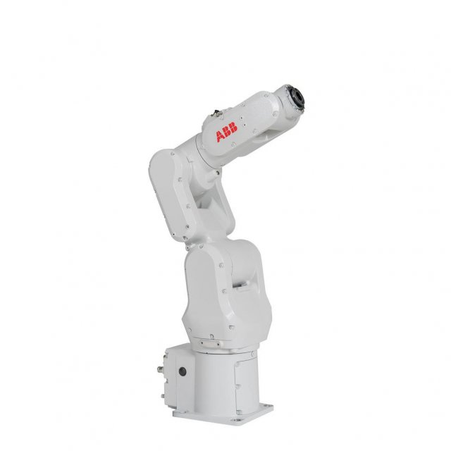

<!-- _class: title -->
<!-- _paginate: false -->
<!-- _footer: "" -->

# ROS 2 Course
<small>ROS 2 Jazzy Jalisco · Ubuntu 24.04 · Gazebo Harmonic</small>

Paweł Irzyk · Robotari
{{ CITY }} · {{ DATE }}

<!--
Speaker notes go here. Replace {{ CITY }} / {{ DATE }} per delivery
(or set them from the build script with sed).
-->

---

# Agenda

**Day 1 – Foundations**
- What ROS is, and where it came from
- ROS 2 concepts: nodes, topics, messages, parameters
- Working from the command line

**Day 2 – Building**
- Workspace, colcon, packages
- rclpy: nodes, publishers, subscribers, parameters
- Launch files

**Day 3 – Tooling**
- Gazebo simulation
- RViz2, TF2, rqt, rosbag
- Robot description (URDF / xacro)

**Day 4 – Advanced communication**
- Services and actions
- Communication strategies
- Course project

<!--
TODO: confirm the 4-day split. This is a proposal derived from the module
order in the original deck; adjust once the hands-on labs are timed.
-->

---

# Paweł Irzyk
<small>Robotics Software Engineer · Tech Lead · Founder of Robotari</small>

- Robotics software engineer and tech lead
- ROS 2 training and robotics consulting at Robotari
- {{ EXPERIENCE_LINE }}

 &nbsp; 
github.com/pawelir

 &nbsp; 
linkedin.com/in/pawelirzyk

<!--
TODO: replace the bullets with your current bio. The QR codes were regenerated
from the URLs in the original deck – check they still point where you want.
-->

---

<!-- _class: divider -->

# Introduction
<small>What ROS is, how its history was shaped, and how it is used today</small>

---

# Robot Operating System

Open-source middleware framework for robot software development

- Designed for modularity
- Flexible and extensible
- Supports a wide range of robots
- Community-driven

---

# ROS in practice

---

# ROS history

- **2006** – Personal project at Stanford: stop "reinventing the wheel" in robotics
- **2008–2014** – Developed at Willow Garage (PR1, PR2)
- **2009** – First distribution: ROS Mango Tango
- **2013** – Stewardship moves to Open Source Robotics Foundation
- **2017** – First ROS 2 distribution: Ardent Apalone
- **2022** – Core team moves to Intrinsic (Alphabet)
- **2024** – Open Source Robotics Alliance (OSRA) takes over governance

---

# ROS growth

Number of public ROS repositories and packages over time

---

# ROS 1 vs ROS 2

What ROS 2 changed:

- **Middleware** – DDS (or Zenoh); no master, scales across machines
- **Quality of Service** – reliability, durability, deadlines per topic
- **Real-time** – deterministic executors, RT-friendly client libraries
- **Security** – authentication, access control, encryption (SROS 2)
- **Launch** – redesigned; Python, XML or YAML
- **Platforms** – Ubuntu Tier 1; Windows and RHEL supported

ROS 1 reached end-of-life with Noetic in May 2025. New projects start on ROS 2.

---

# ROS 2 distributions

| Distribution | Released | EOL | Ubuntu |
|---|---|---|---|
| Humble Hawksbill (LTS) | May 2022 | May 2027 | 22.04 |
| **Jazzy Jalisco (LTS)** | **May 2024** | **May 2029** | **24.04** |
| Kilted Kaiju | May 2025 | Dec 2026 | 24.04 |
| Lyrical Luth (LTS) | May 2026 | May 2031 | 26.04 |
| Rolling Ridley | continuous | – | latest |

- A new distribution every May; even years are LTS (5 years of support)
- This course uses **Jazzy**: mature ecosystem, matches most deployed fleets on Ubuntu 24.04
- Everything shown here also works on Kilted and Lyrical unless noted

---

# Modern applications

Examples of ROS-based robotics products

- **Mobile robots** – [Husarion Panther](https://www.youtube.com/watch?v=aABlD3RVOc8)
- **Underwater robots** – [Hydromea EXRAY](https://www.youtube.com/watch?v=Sh3igUyK7Sc)
- **Industrial arms** – [Nomagic](https://www.youtube.com/watch?v=nIrc_bZnsVs) picking cells

 

