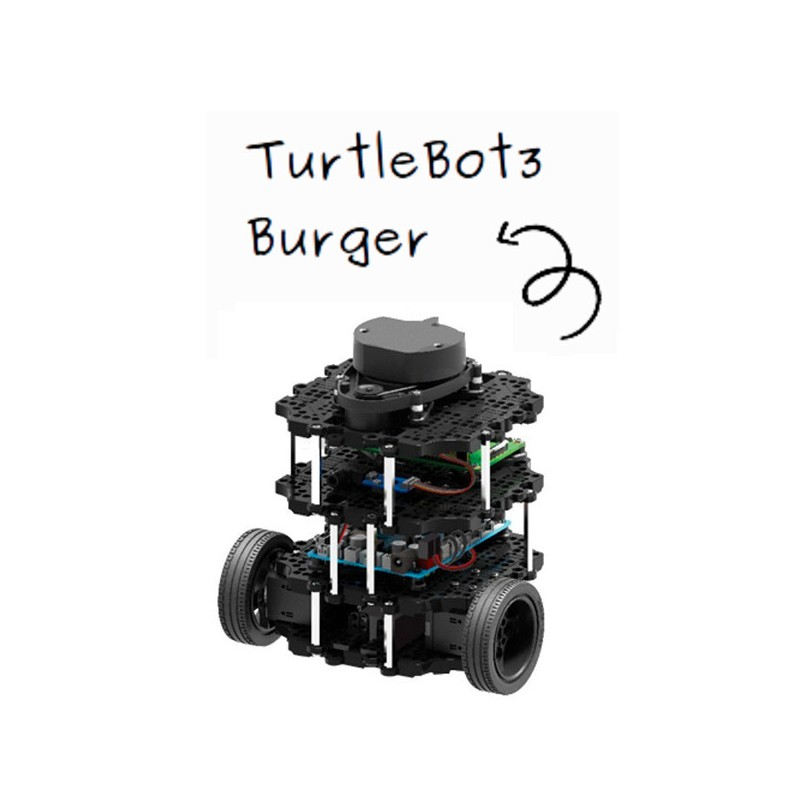
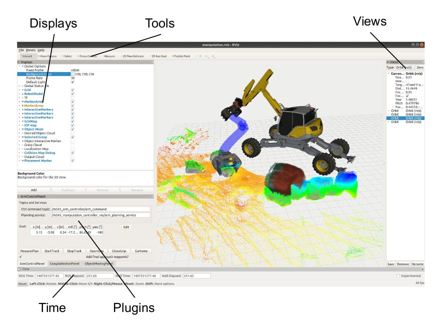
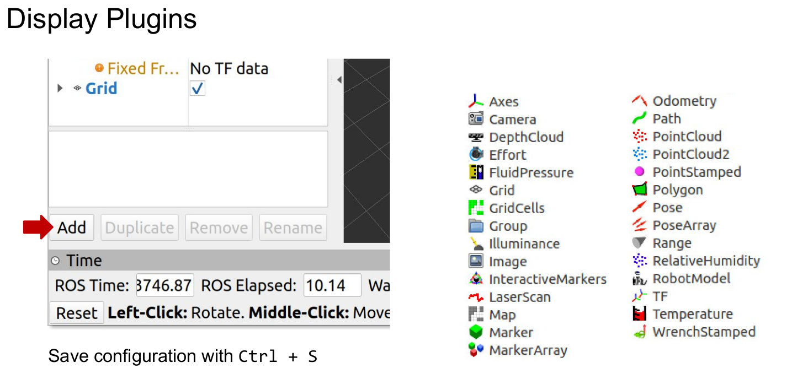
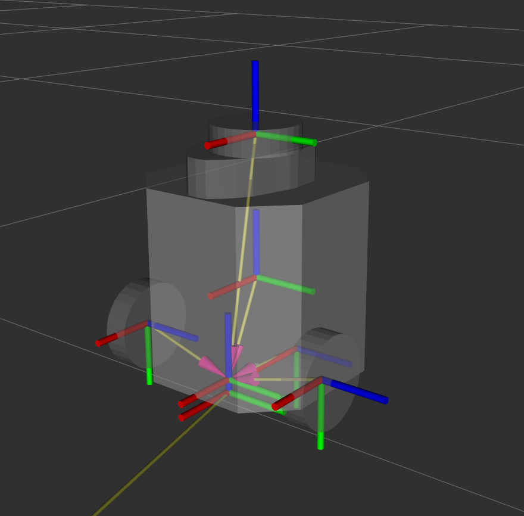
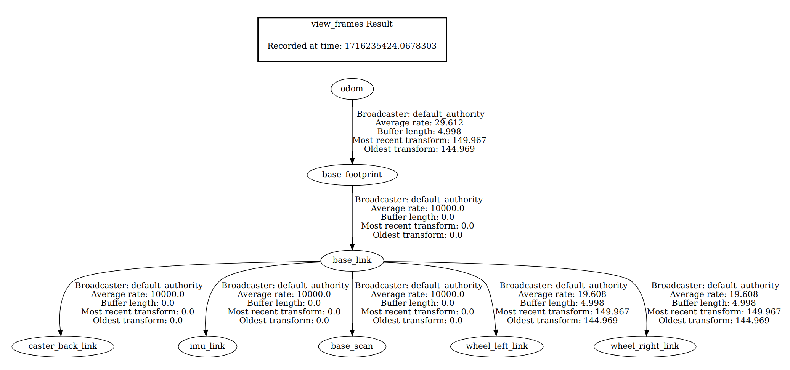
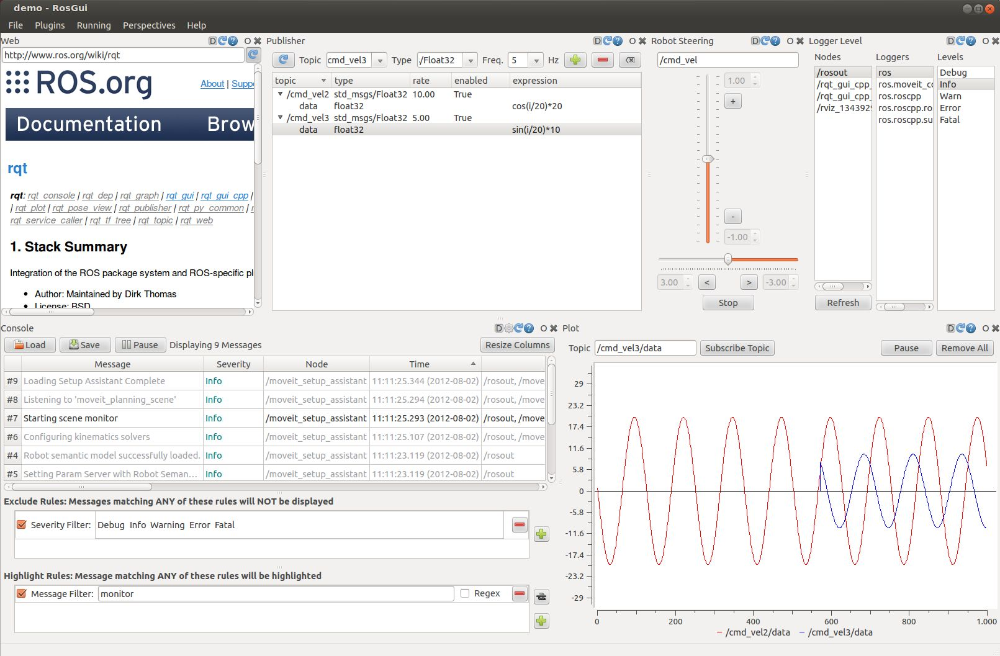
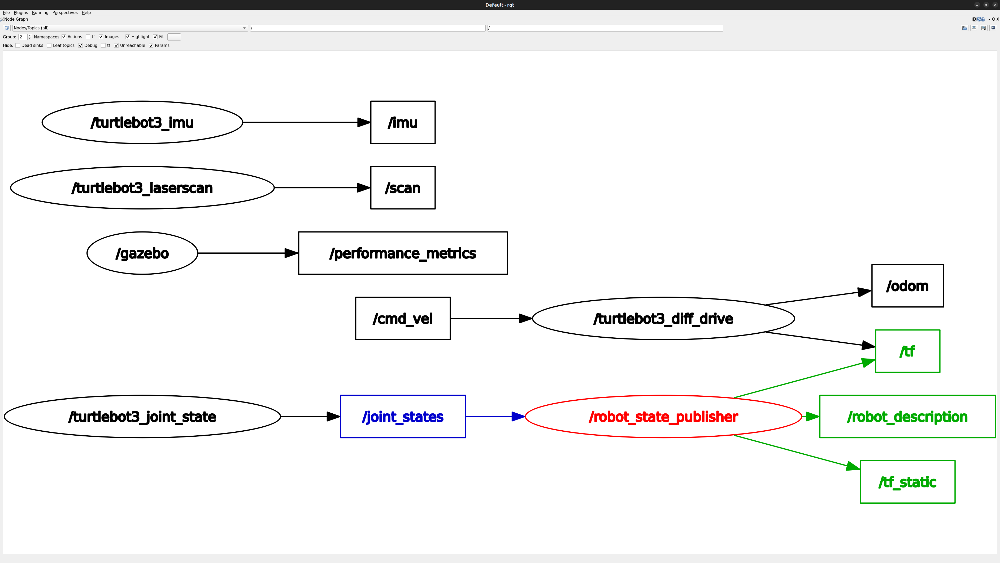
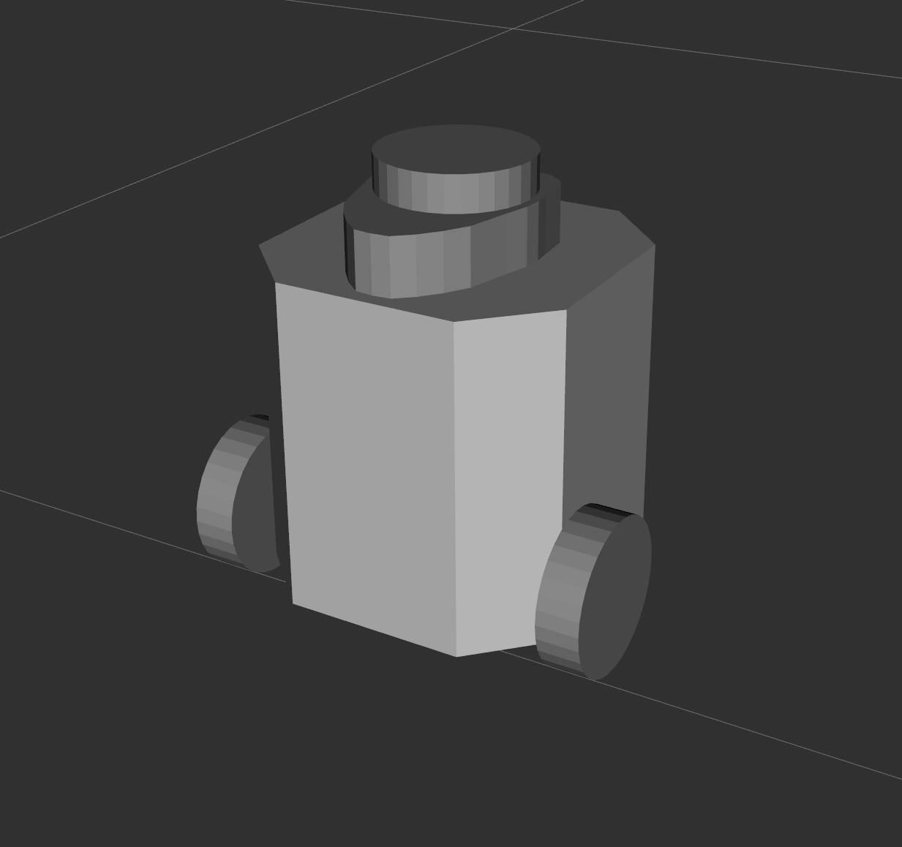
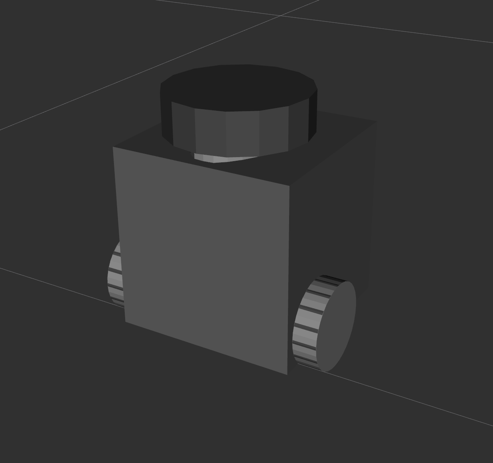
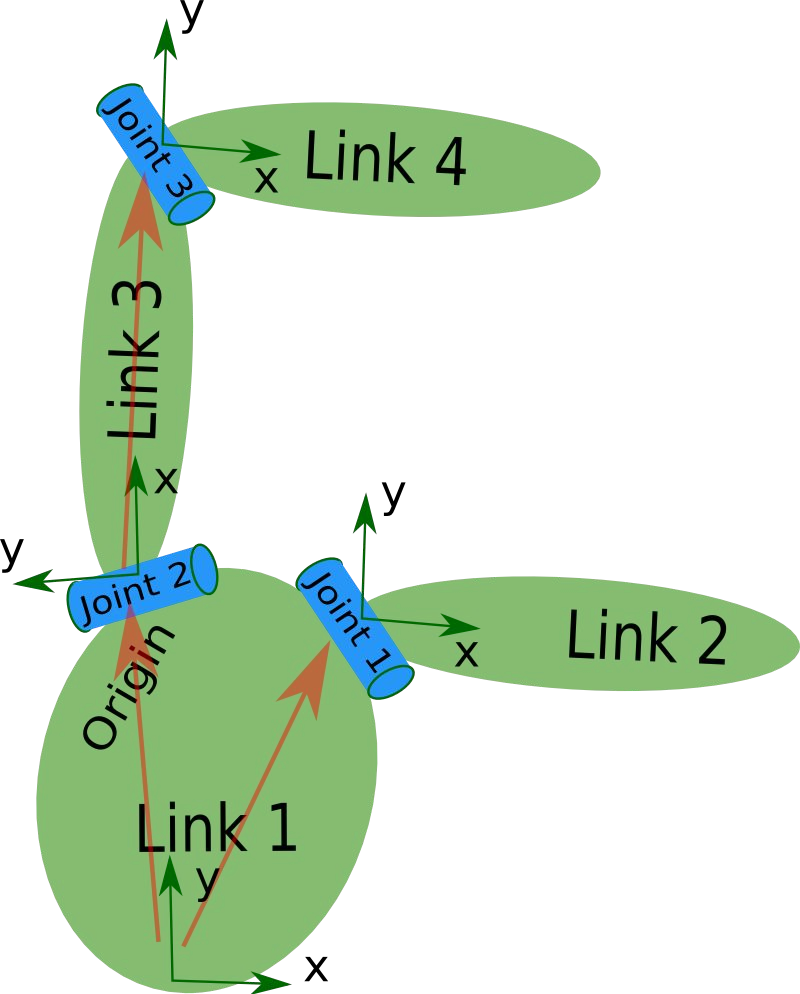

<!-- _class: divider -->

# Tools
<small>Gazebo simulation, RViz2, TF2, rqt, rosbag and robot description</small>

---

# Gazebo simulation

<div class="cols wide-left">
<div>

- Simulates 3D rigid-body dynamics with several physics engines
- Simulates sensors: LiDAR, cameras, IMU, GPS, contact – with configurable noise
- Robots and worlds described in **SDF**; large public model library (Fuel)
- Extensible with plugins ("systems"); the GUI is plugin-based too
- ROS 2 integration through the `ros_gz` packages

This course uses **Gazebo Harmonic**, the release paired with Jazzy.

</div>
<div>

<div class="note">

**Gazebo Classic** (`gazebo_ros`, `.world` files, `spawn_entity.py`) reached end-of-life in January 2025. Tutorials that mention it, or the interim name *Ignition* (`ign`), are outdated.

</div>

</div>
</div>

<p class="ref">Reference: <a href="https://gazebosim.org/docs/harmonic/ros2_integration/">gazebosim.org – ROS 2 integration</a></p>

---

# Gazebo – CLI

<div class="cols">
<div>

Start Gazebo with a world (`-r` runs the simulation immediately)
```bash
ros2 launch ros_gz_sim gz_sim.launch.py gz_args:="-r empty.sdf"
```

Spawn a model into the running world
```bash
ros2 run ros_gz_sim create -world empty -file model.sdf -name robot
```

Bridge a Gazebo topic to ROS (here: the simulation clock)
```bash
ros2 run ros_gz_bridge parameter_bridge \
  /clock@rosgraph_msgs/msg/Clock[gz.msgs.Clock
```

</div>
<div>

Gazebo has its own topics and its own CLI – `gz`, not `ros2`
```bash
gz topic -l
gz topic -e -t /clock
gz model --list
```

| Gazebo Classic | Gazebo Harmonic |
|---|---|
| `gazebo_ros` | `ros_gz_sim` |
| `spawn_entity.py` | `ros_gz_sim create` |
| `libgazebo_ros_*` plugins | gz systems + `ros_gz_bridge` |
| `.world` | `.sdf` |

</div>
</div>

---

# Gazebo – course simulation

<div class="cols wide-left">
<div>

TurtleBot3 Burger in the `turtlebot3_world` arena – the *simulation* VS Code task, or:

```bash
ros2 launch course_bringup sim.launch.py
ros2 launch course_bringup sim.launch.py gui:=false
ros2 launch course_bringup sim.launch.py world:=turtlebot3_house
```

What you get on the ROS side:

- nodes `/robot_state_publisher` and `/ros_gz_bridge`
- `/scan`, `/odom`, `/imu`, `/joint_states` published by the bridge
- `/cmd_vel` (`geometry_msgs/msg/TwistStamped`) driving the robot
- `/tf`, `/tf_static`, `/robot_description`, `/clock`

</div>
<div>



<div class="note">

Nodes that work with simulated data should run with `use_sim_time: true` so their clock follows `/clock`, not the wall clock.

</div>

</div>
</div>

---

# Gazebo – inside the bringup launch file

<style scoped>pre { font-size: 0.64em; }</style>
<div class="cols wide-left">
<div>

<!-- src: examples/course_bringup/launch/sim.launch.py#L33-L49 -->
```python
gz_server = IncludeLaunchDescription(
    PythonLaunchDescriptionSource(os.path.join(ros_gz_sim, 'launch', 'gz_sim.launch.py')),
    launch_arguments={'gz_args': ['-r -s -v2 ', world_file], 'on_exit_shutdown': 'true'}.items())

gz_client = IncludeLaunchDescription(
    PythonLaunchDescriptionSource(os.path.join(ros_gz_sim, 'launch', 'gz_sim.launch.py')),
    launch_arguments={'gz_args': '-g -v2 ', 'on_exit_shutdown': 'true'}.items(),
    condition=IfCondition(LaunchConfiguration('gui')))

robot_state_publisher = IncludeLaunchDescription(
    PythonLaunchDescriptionSource(os.path.join(tb3_gazebo, 'launch', 'robot_state_publisher.launch.py')),
    launch_arguments={'use_sim_time': 'true'}.items())

spawn_robot = IncludeLaunchDescription(
    PythonLaunchDescriptionSource(os.path.join(tb3_gazebo, 'launch', 'spawn_turtlebot3.launch.py')),
    launch_arguments={'x_pose': LaunchConfiguration('x_pose'),
                      'y_pose': LaunchConfiguration('y_pose')}.items())
```

</div>
<div>

- Gazebo is started through `ros_gz_sim`'s own launch file; `gz_args` are plain `gz sim` flags
- `-s` server only, `-g` GUI only, `-r` run immediately, `-v2` verbosity
- Server and GUI are separate processes – the GUI is optional
- The robot is spawned by `turtlebot3_gazebo`, which calls `ros_gz_sim create` and starts the bridge
- `robot_state_publisher` runs with `use_sim_time`

</div>
</div>

---

# Gazebo – include the simulation in your launch file

<style scoped>pre { font-size: 0.7em; }</style>
<div class="cols wide-left">
<div>

<!-- src: solutions/module_3/turtlebot_py_controller/launch/laser_controller.launch.py#L24-L25 -->
```python
use_sim = DeclareLaunchArgument('use_sim', default_value='true',
                                description='Also start the Gazebo simulation')
```

<!-- src: solutions/module_3/turtlebot_py_controller/launch/laser_controller.launch.py#L31-L37 -->
```python
simulation = IncludeLaunchDescription(
    # FindPackageShare is resolved lazily, so use_sim:=false works even without the sim packages installed
    PythonLaunchDescriptionSource(PathJoinSubstitution(
        [FindPackageShare('course_bringup'), 'launch', 'sim.launch.py'])),
    launch_arguments={'gui': LaunchConfiguration('gui')}.items(),
    condition=IfCondition(LaunchConfiguration('use_sim')),
)
```

</div>
<div>

- `IncludeLaunchDescription` nests another package's launch file
- `FindPackageShare` is a *substitution*: resolved only when the include actually runs
- `launch_arguments` passes values down to the included file (`gui`)
- A condition lets the same launch file drive the real robot (`use_sim:=false`)

One command for simulation, controller and visualisation:

```bash
ros2 launch turtlebot_py_controller laser_controller.launch.py
```

</div>
</div>

---

# RViz2

<div class="cols wide-left">
<div>



</div>
<div>

- 3D visualisation tool for ROS 2
- Subscribes to topics and draws their contents: laser scans, point clouds, robot model, paths, markers
- Every display is a plugin; you can write your own
- Save and load the layout as an `.rviz` configuration file

```bash
rviz2
rviz2 -d my_layout.rviz
```

</div>
</div>

<p class="ref">Reference: <a href="https://docs.ros.org/en/jazzy/Tutorials/Intermediate/RViz/RViz-User-Guide/RViz-User-Guide.html">docs.ros.org – RViz user guide</a></p>

---

# RViz2 – displays

<div class="cols wide-left">
<div>



</div>
<div>

- **Fixed Frame** (Global Options) must be a frame that exists – e.g. `odom` or `map`; otherwise nothing is drawn
- *Add* → pick a display type, then choose its topic
- Adjust size and colour of laser points; check the QoS if a topic shows no data
- Ctrl+S saves the configuration

Sensor data is usually published *best effort* – the display must match.

</div>
</div>

---

# RViz2 – configuration and launch

<style scoped>pre { font-size: 0.66em; }</style>
<div class="cols">
<div>

Saved layout, `rviz/laser.rviz` (excerpt):

<!-- src: solutions/module_3/turtlebot_py_controller/rviz/laser.rviz#L17-L28 -->
```yaml
    - Class: rviz_default_plugins/LaserScan
      Enabled: true
      Name: LaserScan
      Size (m): 0.05
      Style: Points
      Color Transformer: Intensity
      Topic:
        Value: /scan
        Depth: 5
        Durability Policy: Volatile
        History Policy: Keep Last
        Reliability Policy: Best Effort
```

</div>
<div>

Start RViz with that layout from a launch file:

<!-- src: solutions/module_3/turtlebot_py_controller/launch/laser_controller.launch.py#L48-L52 -->
```python
rviz = Node(
    package='rviz2', executable='rviz2', name='rviz2', output='log',
    arguments=['-d', rviz_config],
    condition=IfCondition(LaunchConfiguration('use_rviz')),
)
```

- The `.rviz` file is installed via `data_files` in `setup.py`
- `output='log'` keeps RViz's chatter out of the terminal
- `use_rviz:=false` for headless runs

</div>
</div>

---

# TF2

<div class="cols wide-left">
<div>

- Keeps track of all **coordinate frames** in the system over time
- Maintains the relation (translation + rotation) between frames as a **tree**
- Transforms points, poses and vectors between any two frames, at any time in the buffer
- Implemented with publishers and subscribers on `/tf` (moving) and `/tf_static` (fixed)
- Distributed: any node can broadcast a transform, any node can listen

The TurtleBot3 tree:
`odom → base_footprint → base_link → base_scan`
– the first link moves (odometry), the rest are fixed

</div>
<div>



</div>
</div>

<p class="ref">Reference: <a href="https://docs.ros.org/en/jazzy/Concepts/Intermediate/About-Tf2.html">docs.ros.org – About tf2</a></p>

---

# TF2 – CLI

<div class="cols wide-left">
<div>

Publish a fixed transform without writing code
```bash
ros2 run tf2_ros static_transform_publisher --x 0.1 --z 0.2 \
  --frame-id base_link --child-frame-id laser
```

Print the transform between two frames
```bash
ros2 run tf2_ros tf2_echo <parent_frame> <child_frame>
ros2 run tf2_ros tf2_echo odom base_scan
```

Draw the tree of frames to `frames.pdf`
```bash
ros2 run tf2_tools view_frames
```

Monitor rates and delays of all frames
```bash
ros2 run tf2_ros tf2_monitor
```

</div>
<div>



</div>
</div>

---

# TF2 – static broadcaster

<style scoped>pre { font-size: 0.68em; }</style>
<div class="cols wide-left">
<div>

<!-- src: examples/ros2_examples/ros2_examples/tf2/static_broadcaster.py#L24-L39 -->
```python
def __init__(self):
    super().__init__('static_broadcaster')
    self.broadcaster = StaticTransformBroadcaster(self)

    t = TransformStamped()
    t.header.stamp = self.get_clock().now().to_msg()
    t.header.frame_id = 'base_link'          # parent
    t.child_frame_id = 'laser'               # child
    t.transform.translation.x = 0.1
    t.transform.translation.z = 0.2
    qx, qy, qz, qw = quaternion_from_yaw(math.radians(90))
    t.transform.rotation.x = qx
    t.transform.rotation.y = qy
    t.transform.rotation.z = qz
    t.transform.rotation.w = qw
    self.broadcaster.sendTransform(t)        # sent once, latched for late subscribers
```

</div>
<div>

- A transform is a `geometry_msgs/msg/TransformStamped`: stamp, parent frame, child frame, translation, rotation (quaternion)
- `StaticTransformBroadcaster` publishes once on `/tf_static`; the message is latched so late starters still get it
- Use it for sensor mounts and anything bolted to the robot

```bash
ros2 run ros2_examples static_broadcaster
ros2 run tf2_ros tf2_echo base_link laser
```

</div>
</div>

---

# TF2 – dynamic broadcaster

<style scoped>pre { font-size: 0.68em; }</style>
<div class="cols wide-left">
<div>

<!-- src: examples/ros2_examples/ros2_examples/tf2/dynamic_broadcaster.py#L25-L39 -->
```python
def tick(self):
    now = self.get_clock().now()
    elapsed = (now - self.t0).nanoseconds * 1e-9
    radius, omega = 1.0, 0.5               # m, rad/s
    yaw = omega * elapsed

    t = TransformStamped()
    t.header.stamp = now.to_msg()
    t.header.frame_id = 'odom'
    t.child_frame_id = 'base_link'
    t.transform.translation.x = radius * math.cos(yaw)
    t.transform.translation.y = radius * math.sin(yaw)
    t.transform.rotation.z = math.sin((yaw + math.pi / 2) / 2)
    t.transform.rotation.w = math.cos((yaw + math.pi / 2) / 2)
    self.broadcaster.sendTransform(t)
```

</div>
<div>

- `TransformBroadcaster` publishes on `/tf`; call it from a timer or from the callback that produces the pose
- The stamp must be the time the pose is valid for – listeners interpolate between stamps
- Here a robot drives in a circle: `odom → base_link` changes 20 times a second

```bash
ros2 run ros2_examples dynamic_broadcaster
ros2 run tf2_ros tf2_echo odom base_link
```

Add a TF display in RViz2 with Fixed Frame `odom` to watch it move.

</div>
</div>

---

# TF2 – listener

<style scoped>pre { font-size: 0.68em; }</style>
<div class="cols wide-left">
<div>

<!-- src: examples/ros2_examples/ros2_examples/tf2/frame_listener.py#L19-L31 -->
```python
def __init__(self):
    super().__init__('frame_listener')
    self.tf_buffer = Buffer()
    self.tf_listener = TransformListener(self.tf_buffer, self)   # fills the buffer from /tf, /tf_static
    self.create_timer(1.0, self.tick)

def tick(self):
    try:
        # (target frame, source frame, time). Time 0 = "latest available".
        t = self.tf_buffer.lookup_transform('odom', 'laser', rclpy.time.Time())
    except TransformException as ex:
        self.get_logger().warn(f'Could not transform odom -> laser: {ex}')
        return
```

</div>
<div>

- `Buffer` stores the recent history of all transforms; `TransformListener` fills it from `/tf` and `/tf_static`
- `lookup_transform(target, source, time)` walks the tree for you: `odom → base_link → laser`
- Always catch `TransformException` – the transform may not exist yet, or the time may be too old

```bash
ros2 run ros2_examples static_broadcaster
ros2 run ros2_examples dynamic_broadcaster
ros2 run ros2_examples frame_listener
```

</div>
</div>

---

# rqt

<div class="cols wide-left">
<div>



</div>
<div>

- Qt-based GUI framework; every tool is a plugin
- Dock several plugins into one window and save the perspective

```bash
rqt
rqt_graph
ros2 run rqt_console rqt_console
ros2 run rqt_reconfigure rqt_reconfigure
ros2 run rqt_plot rqt_plot
```

- **Console** – filter logs by severity, node or text
- **Reconfigure** – change parameters with sliders
- **Plot** – numeric fields of a topic over time

</div>
</div>

---

# rqt_graph



<p class="caption">The computation graph of the TurtleBot3 simulation: ellipses are nodes, rectangles are topics</p>

---

# rosbag

<div class="cols">
<div>

- Records topics to disk and plays them back later with the original timing
- Debug a problem seen in the field back in the lab
- Develop against recorded sensor data – no robot, no simulation needed
- Jazzy default storage is **MCAP**; `sqlite3` is still available

Play with the simulated clock so nodes using `use_sim_time` follow the bag:

```bash
ros2 bag play --clock my_bag
```

</div>
<div>

Record everything, or a selection of topics
```bash
ros2 bag record -a
ros2 bag record -o laser_run /scan /odom /tf /tf_static
```

Inspect a bag
```bash
ros2 bag info laser_run
```

Play it back
```bash
ros2 bag play laser_run
ros2 bag play --loop --rate 0.5 laser_run
```

</div>
</div>

<p class="ref">Reference: <a href="https://docs.ros.org/en/jazzy/Tutorials/Beginner-CLI-Tools/Recording-And-Playing-Back-Data/Recording-And-Playing-Back-Data.html">docs.ros.org – Recording and playing back data</a></p>

---

# Robot models – URDF

<div class="cols wide-left">
<div>

**Unified Robot Description Format** – an XML description of a robot:

- **Kinematics** – the chain of links and joints
- **Visual** geometry – meshes or primitives for rendering
- **Collision** geometry – simplified shapes for physics
- **Inertial** properties – mass and inertia per link

**xacro** adds macros, parameters and maths on top of URDF; the `.xacro` file is expanded to plain URDF at launch time.

Gazebo reads the same description (or SDF) to simulate the robot.

</div>
<div>

  

<p class="caption">Real robot · visual model · collision model</p>

</div>
</div>

<p class="ref">Reference: <a href="https://docs.ros.org/en/jazzy/Tutorials/Intermediate/URDF/URDF-Main.html">docs.ros.org – URDF tutorials</a></p>

---

# URDF – links and joints

<div class="cols wide-left">
<div>

- **Link** – a rigid body of the robot: `base_link`, `wheel_left_link`, `laser`
- **Joint** – connects a parent link to a child link and constrains the motion between them

| Joint type | Motion |
|---|---|
| `fixed` | none – sensor mounts, chassis parts |
| `continuous` | unlimited rotation – wheels |
| `revolute` | rotation with limits – arm joints |
| `prismatic` | linear slide |

The link/joint tree of the URDF **is** the TF tree: `robot_state_publisher` turns it into `/tf` and `/tf_static`.

</div>
<div>



</div>
</div>

---

# URDF – in the running system

<style scoped>pre { font-size: 0.7em; }</style>
<div class="cols">
<div>

- `robot_state_publisher` loads the URDF as the parameter `robot_description` and publishes it on the `/robot_description` topic
- Fixed joints go to `/tf_static`; moving joints need `/joint_states` (from the driver or the simulation) and are published on `/tf`
- RViz's **RobotModel** display renders the description – the TurtleBot3 simulation publishes it for you

```bash
check_urdf robot.urdf
xacro robot.urdf.xacro > robot.urdf
```

</div>
<div>

RobotModel display in the saved RViz layout:

<!-- src: solutions/module_3/turtlebot_py_controller/rviz/laser.rviz#L29-L35 -->
```yaml
    - Class: rviz_default_plugins/RobotModel
      Enabled: true
      Name: RobotModel
      Description Topic:
        Value: /robot_description
        Durability Policy: Transient Local
        Reliability Policy: Reliable
```

`Transient Local` durability: the description is published once and kept for late subscribers – the same idea as `/tf_static`.

</div>
</div>
